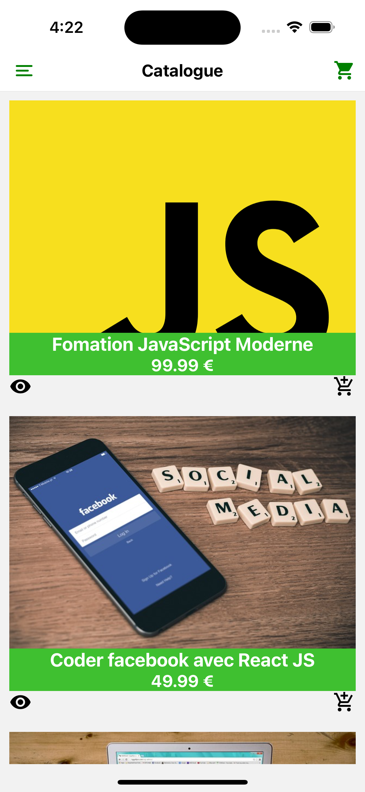
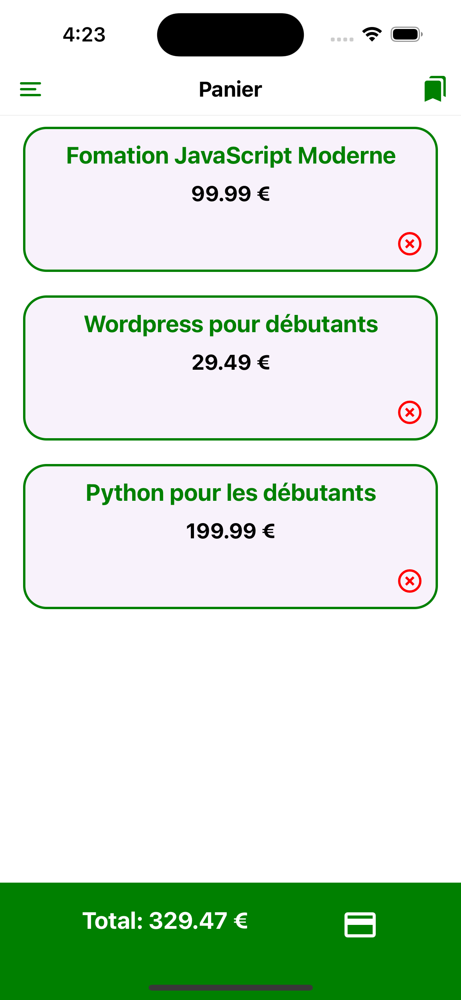
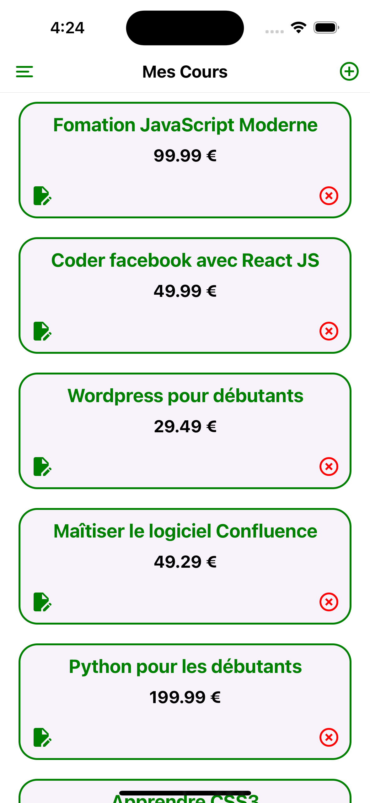
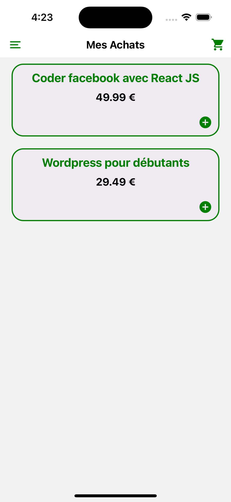
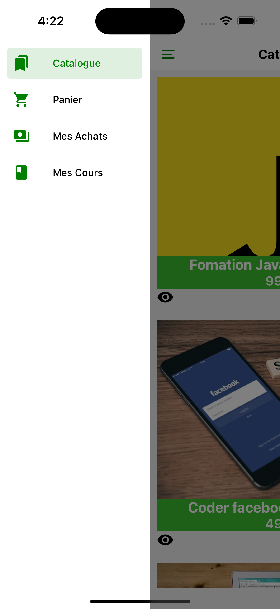
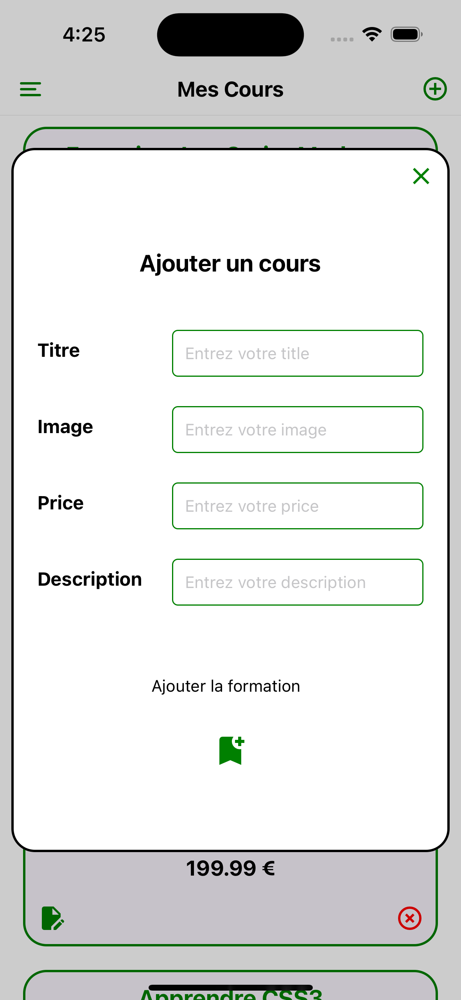

# Application de Vente de Formations en Ligne

Bienvenue dans l'application de vente de formations en ligne ! Cette application vous permet de parcourir, acheter et suivre des formations à partir de votre appareil mobile.

## Fonctionnalités

L'application propose les fonctionnalités suivantes :

- **Catalogue** : Parcourez une large sélection de formations organisées par catégories. Consultez les détails des cours, y compris leur description, leur prix et leur instructeur.

- **Panier** : Ajoutez des formations à votre panier pour les acheter ultérieurement. Gérez les cours ajoutés, supprimez-les ou modifiez la quantité.

- **Mes Cours** : Consultez les cours que vous avez achetés et suivez votre progression. Accédez facilement aux ressources et aux vidéos de chaque cours.

- **Mes Achats** : Consultez l'historique de vos achats, y compris les détails des cours, les dates d'achat et les montants.

## Captures d'écran

Voici un aperçu visuel des différents écrans de l'application :

| catalogue | pannier |
|:---------:|:------:|
|  |  |

| cours | achats |
|:---------:|:----------:|
|  |  |

| drawer | addcours |
|:---------:|:----------:|
|  |  |

## Installation et Utilisation

Pour installer et utiliser l'application, suivez les étapes suivantes :

1. Clonez ce dépôt sur votre machine locale.
2. Installez les dépendances en exécutant `npm install`.
3. Lancez l'application en exécutant `npm start`.
4. Explorez les différents écrans et fonctionnalités de l'application !

